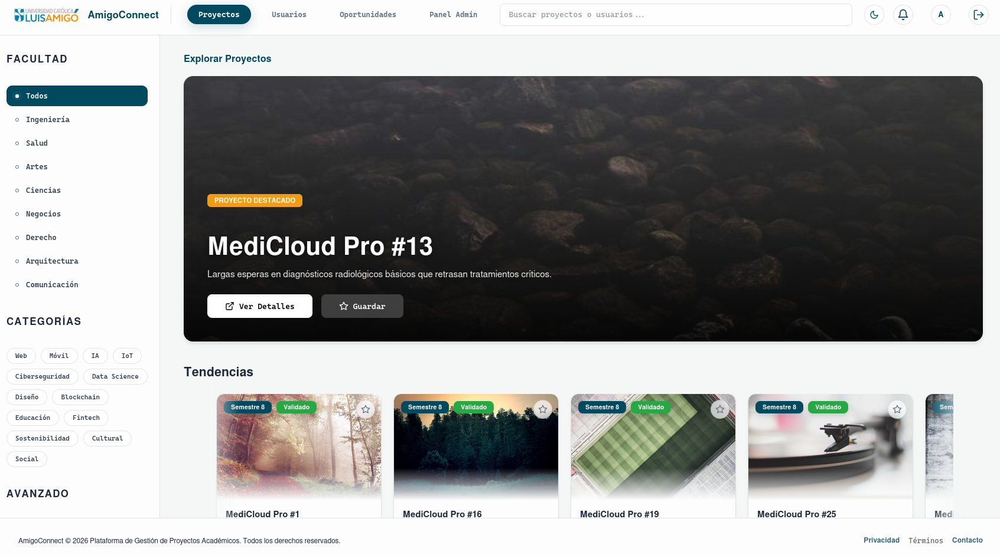
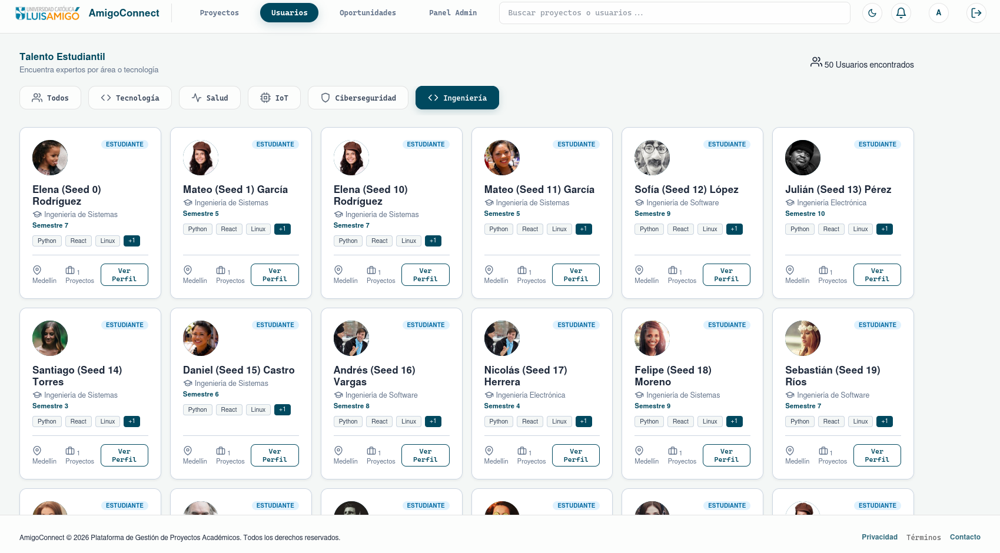
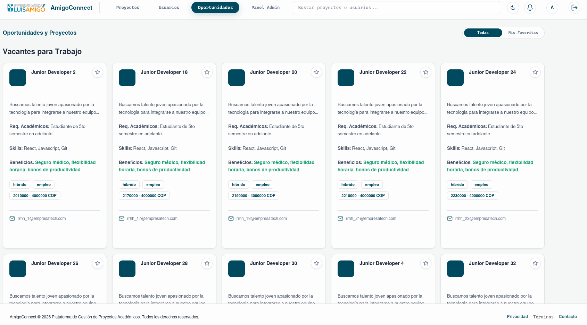
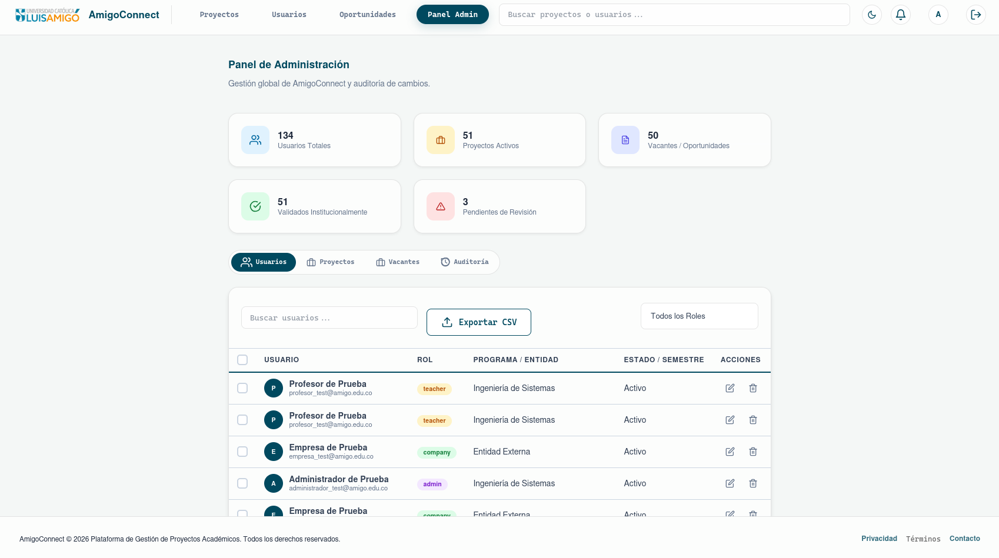
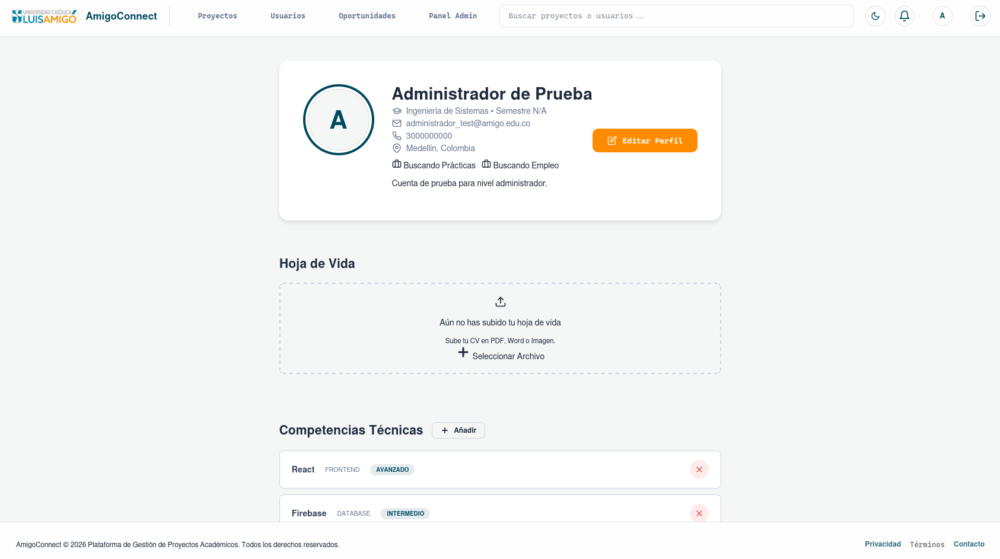

#  AmigoConnect

[](https://amigoconnect-d7900.web.app/)

> **Plataforma de Gestión, Portafolio y Colaboración para Estudiantes de la Universidad Católica Luis Amigó.**

[](https://reactjs.org/)
[](https://vitejs.dev/)
[](https://firebase.google.com/)
[](https://opensource.org/licenses/MIT)

---

## 📸 Vista Previa

<div align="center">
  <table>
    <tr>
      <td width="50%" align="center">
        
        <br><i>Dashboard de Proyectos</i>
      </td>
      <td width="50%" align="center">
        
        <br><i>Gestión de Usuarios</i>
      </td>
    </tr>
    <tr>
      <td width="50%" align="center">
        
        <br><i>Módulo de Oportunidades</i>
      </td>
      <td width="50%" align="center">
        
        <br><i>Estadísticas y Auditoría</i>
      </td>
    </tr>
    <tr>
      <td colspan="2" align="center">
        
        <br><i>Perfil Profesional</i>
      </td>
    </tr>
  </table>
</div>

---

## 🚀 Descripción

**AmigoConnect** es una solución digital diseñada para centralizar y potenciar el talento de los estudiantes de la Universidad Católica Luis Amigó. La plataforma permite a los usuarios crear portafolios interactivos, compartir proyectos académicos, descubrir oportunidades laborales y colaborar en un ecosistema académico moderno y eficiente.

No es solo un repositorio de proyectos; es una red social profesional académica que facilita la transición de los estudiantes al mundo laboral mediante el reconocimiento de sus habilidades y logros.

---

## ✨ Características Principales

### 🎓 Para Estudiantes
- **Portafolio Multimedia**: Sube proyectos con descripciones detalladas, imágenes, tech stack y enlaces a repositorios/demos.
- **Gestión de Proyectos**: Sistema de edición y carga premium con múltiples metadatos (TRL, Estado, Licencia).
- **Tablero de Oportunidades**: Descubre vacantes de empleo y proyectos de investigación de empresas aliadas.
- **Contacto Directo**: Botones de contacto integrados (`mailto:`) en perfiles, proyectos y vacantes.
- **Interacción**: Sistema de favoritos, notificaciones en tiempo real y contador de visualizaciones.

### 🛡️ Para Administradores y Docentes
- **Moderación Inteligente**: Aprobación o rechazo de contenido con requerimiento de motivo para transparencia.
- **Gestión de Usuarios**: Control de roles (Estudiante, Docente, Empresa, Admin).
- **Logs de Auditoría**: Seguimiento detallado de cada acción crítica realizada en la plataforma.
- **Herramientas de Debugging**: Comandos rápidos para regeneración de datos (`Ctrl+V`) y limpieza de logs (`Ctrl+C`).

### 🔍 Descubrimiento y UX
- **Filtros Avanzados**: Búsqueda por semestre, facultad, categoría, estado de desarrollo y nivel de madurez (TRL).
- **Diseño Glassmorphism**: Interfaz moderna, limpia y responsive con soporte para modo oscuro.
- **Notificaciones Dinámicas**: Pop-up de notificaciones con sistema de marcado de lectura y cierre inteligente.

---

## 🛠️ Tecnologías

- **Frontend**: 
  - [React 19](https://reactjs.org/) (Context API, Hooks avanzados).
  - [Vite](https://vitejs.dev/) (Build tool).
  - CSS3 Vanila (Diseño Responsivo y Micro-animaciones).
- **Backend (Firebase Services)**:
  - **Firestore**: Base de datos NoSQL en tiempo real.
  - **Authentication**: Google OAuth e Email/Password.
  - **Storage**: Gestión de imágenes de proyectos y avatares.
  - **Hosting**: Despliegue en la nube de Google.

---

## 🔧 Instalación y Configuración

### 1. Clonar el Repositorio
```bash
git clone https://github.com/Jawuj/AmigoConnect.git
cd AmigoConnect
```

### 2. Instalar Dependencias
```bash
npm install
```

### 3. Configuración de Firebase
Crea un archivo `.env` o actualiza `src/firebase.js` con tus credenciales de Firebase:
```javascript
const firebaseConfig = {
  apiKey: "TU_API_KEY",
  authDomain: "TU_DOMAIN",
  projectId: "TU_PROJECT_ID",
  storageBucket: "TU_STORAGE_BUCKET",
  messagingSenderId: "TU_SENDER_ID",
  appId: "TU_APP_ID"
};
```

### 4. Ejecutar en Desarrollo
```bash
npm run dev
```

---

## 📂 Estructura del Proyecto

```text
AmigoConnect/
├── public/                 # Recursos estáticos
├── images/                 # Capturas de pantalla para documentación
├── src/
│   ├── components/         # UI modularizada (Auth, Layout, Modals, Shared)
│   ├── hooks/              # Lógica de negocio (Firestore, Actions, Auth)
│   ├── pages/              # Vistas principales (Dashboard, Admin, Profile, Opportunities)
│   ├── constants/          # Filtros y diccionarios de datos
│   ├── styles/             # Hojas de estilo modulares
│   ├── utils/              # Funciones de utilidad y Seeder
│   └── App.jsx             # Punto de entrada y gestión de estado
```

---

## 🤝 Contribución

¡Las contribuciones son bienvenidas!

1. Haz un **Fork** del proyecto.
2. Crea una **Rama** funcional (`git checkout -b feature/AmazingFeature`).
3. Realiza un **Commit** (`git commit -m 'Add some AmazingFeature'`).
4. Haz **Push** (`git push origin feature/AmazingFeature`).
5. Abre un **Pull Request**.

---

## 📞 Contacto

**Universidad Católica Luis Amigó**  
Desarrollado para el fortalecimiento del ecosistema académico.

[Sitio Web del Proyecto](https://amigoconnect-d7900.web.app/)

---
*AmigoConnect - Impulsando el talento académico a través de la tecnología.*